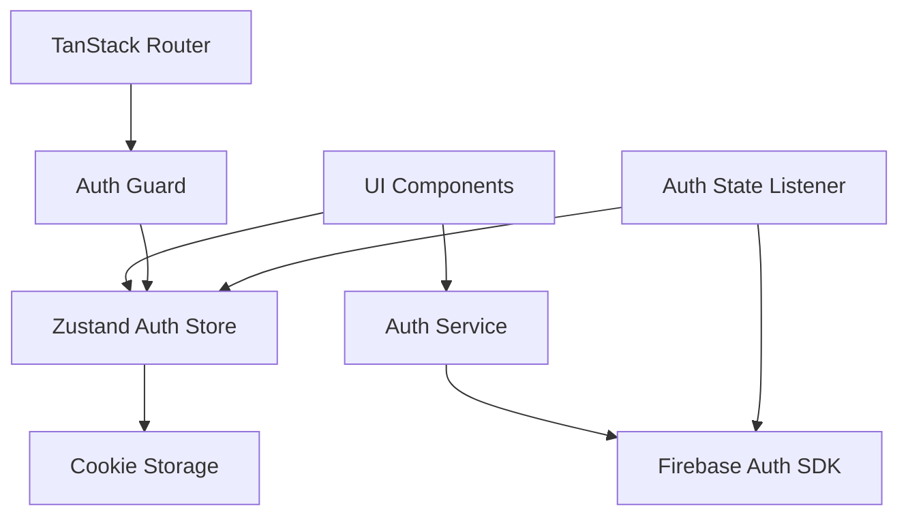
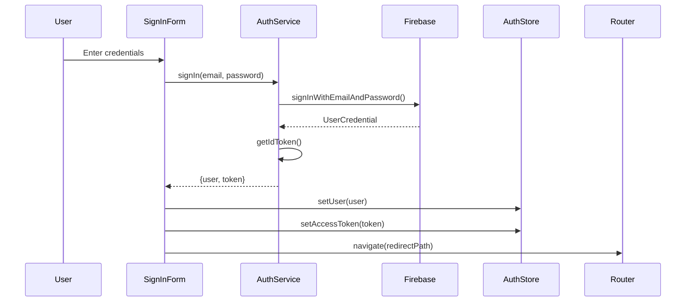
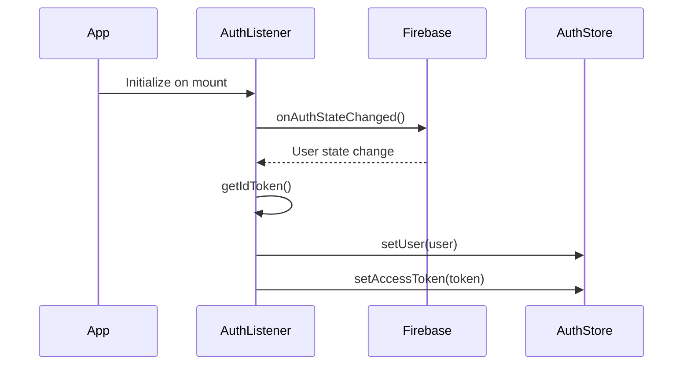

# Design Document: Firebase Authentication Migration

## Overview

This design document outlines the architecture and implementation strategy for migrating the Shadcn Admin dashboard from Clerk authentication to Firebase Authentication. The migration maintains all existing authentication features while replacing the underlying provider with Firebase's modular SDK (v9+).

The design follows a layered architecture approach:
- **Service Layer**: Encapsulates all Firebase Authentication operations
- **State Management Layer**: Zustand store for global authentication state
- **UI Layer**: React components for authentication flows
- **Route Protection Layer**: TanStack Router integration for protected routes

Key design principles:
- Maintain existing UI/UX without breaking changes
- Use Firebase modular SDK for optimal bundle size
- Implement automatic token refresh and session management
- Provide comprehensive error handling with user-friendly messages
- Follow React best practices with hooks and context patterns

## Architecture

### High-Level Architecture



### Component Interaction Flow

**Sign-In Flow:**



**Authentication State Management:**


### Directory Structure

The implementation will follow the existing project structure:

```
src/
├── lib/
│   ├── firebase/
│   │   ├── config.ts           # Firebase configuration
│   │   ├── auth-service.ts     # Authentication service layer
│   │   └── error-handler.ts    # Firebase error translation
│   └── utils.ts
├── stores/
│   └── auth-store.ts           # Updated Zustand store
├── hooks/
│   ├── use-auth.ts             # Custom auth hook
│   └── use-auth-listener.ts    # Auth state listener hook
├── features/
│   └── auth/
│       ├── sign-in/
│       │   ├── index.tsx
│       │   └── components/
│       │       └── user-auth-form.tsx  # Updated form
│       ├── sign-up/
│       │   ├── index.tsx
│       │   └── components/
│       │       └── sign-up-form.tsx    # Updated form
│       ├── forgot-password/
│       │   ├── index.tsx
│       │   └── components/
│       │       └── forgot-password-form.tsx  # Updated form
│       └── otp/
│           ├── index.tsx
│           └── components/
│               └── otp-form.tsx        # Updated for email verification
└── routes/
    └── __root.tsx                      # Auth listener initialization
```


## Components and Interfaces

### Firebase Configuration

**File: `src/lib/firebase/config.ts`**

```typescript
import { initializeApp, type FirebaseApp } from 'firebase/app'
import { getAuth, type Auth } from 'firebase/auth'

interface FirebaseConfig {
  apiKey: string
  authDomain: string
  projectId: string
  storageBucket: string
  messagingSenderId: string
  appId: string
}

// Firebase configuration from environment variables
const firebaseConfig: FirebaseConfig = {
  apiKey: import.meta.env.VITE_FIREBASE_API_KEY,
  authDomain: import.meta.env.VITE_FIREBASE_AUTH_DOMAIN,
  projectId: import.meta.env.VITE_FIREBASE_PROJECT_ID,
  storageBucket: import.meta.env.VITE_FIREBASE_STORAGE_BUCKET,
  messagingSenderId: import.meta.env.VITE_FIREBASE_MESSAGING_SENDER_ID,
  appId: import.meta.env.VITE_FIREBASE_APP_ID,
}

// Initialize Firebase
export const app: FirebaseApp = initializeApp(firebaseConfig)
export const auth: Auth = getAuth(app)
```

**Environment Variables (.env):**
```
VITE_FIREBASE_API_KEY=your-api-key
VITE_FIREBASE_AUTH_DOMAIN=your-project.firebaseapp.com
VITE_FIREBASE_PROJECT_ID=your-project-id
VITE_FIREBASE_STORAGE_BUCKET=your-project.appspot.com
VITE_FIREBASE_MESSAGING_SENDER_ID=your-sender-id
VITE_FIREBASE_APP_ID=your-app-id
```


### Authentication Service

**File: `src/lib/firebase/auth-service.ts`**

The authentication service provides a clean API for all Firebase authentication operations:

```typescript
import {
  createUserWithEmailAndPassword,
  signInWithEmailAndPassword,
  signOut as firebaseSignOut,
  sendPasswordResetEmail,
  sendEmailVerification,
  updatePassword,
  type User,
  type UserCredential,
  GoogleAuthProvider,
  signInWithPopup,
} from 'firebase/auth'
import { auth } from './config'
import { handleAuthError } from './error-handler'

export interface AuthUser {
  uid: string
  email: string | null
  emailVerified: boolean
  displayName: string | null
}

export interface SignInResult {
  user: AuthUser
  token: string
}

class AuthService {
  // Convert Firebase User to AuthUser
  private toAuthUser(user: User): AuthUser {
    return {
      uid: user.uid,
      email: user.email,
      emailVerified: user.emailVerified,
      displayName: user.displayName,
    }
  }

  // Get ID token from user
  private async getToken(user: User): Promise<string> {
    return await user.getIdToken()
  }

  // Sign in with email and password
  async signIn(email: string, password: string): Promise<SignInResult> {
    try {
      const credential: UserCredential = await signInWithEmailAndPassword(
        auth,
        email,
        password
      )
      const token = await this.getToken(credential.user)
      return {
        user: this.toAuthUser(credential.user),
        token,
      }
    } catch (error) {
      throw handleAuthError(error)
    }
  }

  // Sign up with email and password
  async signUp(email: string, password: string): Promise<SignInResult> {
    try {
      const credential: UserCredential = await createUserWithEmailAndPassword(
        auth,
        email,
        password
      )
      // Send verification email
      await sendEmailVerification(credential.user)
      const token = await this.getToken(credential.user)
      return {
        user: this.toAuthUser(credential.user),
        token,
      }
    } catch (error) {
      throw handleAuthError(error)
    }
  }

  // Sign out
  async signOut(): Promise<void> {
    try {
      await firebaseSignOut(auth)
    } catch (error) {
      throw handleAuthError(error)
    }
  }

  // Send password reset email
  async sendPasswordReset(email: string): Promise<void> {
    try {
      await sendPasswordResetEmail(auth, email)
    } catch (error) {
      throw handleAuthError(error)
    }
  }

  // Resend email verification
  async resendVerificationEmail(): Promise<void> {
    try {
      const user = auth.currentUser
      if (!user) {
        throw new Error('No user is currently signed in')
      }
      await sendEmailVerification(user)
    } catch (error) {
      throw handleAuthError(error)
    }
  }

  // Update password
  async updatePassword(newPassword: string): Promise<void> {
    try {
      const user = auth.currentUser
      if (!user) {
        throw new Error('No user is currently signed in')
      }
      await updatePassword(user, newPassword)
    } catch (error) {
      throw handleAuthError(error)
    }
  }

  // Sign in with Google
  async signInWithGoogle(): Promise<SignInResult> {
    try {
      const provider = new GoogleAuthProvider()
      const credential = await signInWithPopup(auth, provider)
      const token = await this.getToken(credential.user)
      return {
        user: this.toAuthUser(credential.user),
        token,
      }
    } catch (error) {
      throw handleAuthError(error)
    }
  }

  // Get current user
  getCurrentUser(): User | null {
    return auth.currentUser
  }

  // Get current token
  async getCurrentToken(): Promise<string | null> {
    const user = auth.currentUser
    if (!user) return null
    return await this.getToken(user)
  }
}

export const authService = new AuthService()
```


### Error Handler

**File: `src/lib/firebase/error-handler.ts`**

Translates Firebase error codes into user-friendly messages:

```typescript
import { FirebaseError } from 'firebase/app'

export class AuthError extends Error {
  constructor(
    message: string,
    public code?: string
  ) {
    super(message)
    this.name = 'AuthError'
  }
}

export function handleAuthError(error: unknown): AuthError {
  if (error instanceof FirebaseError) {
    const message = getErrorMessage(error.code)
    return new AuthError(message, error.code)
  }

  if (error instanceof Error) {
    return new AuthError(error.message)
  }

  return new AuthError('An unexpected error occurred. Please try again.')
}

function getErrorMessage(code: string): string {
  const errorMessages: Record<string, string> = {
    // Sign in errors
    'auth/invalid-email': 'Invalid email address format.',
    'auth/user-disabled': 'This account has been disabled.',
    'auth/user-not-found': 'Invalid email or password.',
    'auth/wrong-password': 'Invalid email or password.',
    'auth/invalid-credential': 'Invalid email or password.',
    
    // Sign up errors
    'auth/email-already-in-use': 'This email is already registered.',
    'auth/weak-password': 'Password must be at least 8 characters long.',
    'auth/operation-not-allowed': 'Email/password accounts are not enabled.',
    
    // Password reset errors
    'auth/missing-email': 'Please enter your email address.',
    'auth/invalid-action-code': 'This password reset link is invalid or has expired.',
    'auth/expired-action-code': 'This password reset link has expired.',
    
    // Network errors
    'auth/network-request-failed': 'Network error. Please check your connection and try again.',
    'auth/too-many-requests': 'Too many attempts. Please try again later.',
    
    // Token errors
    'auth/id-token-expired': 'Your session has expired. Please sign in again.',
    'auth/id-token-revoked': 'Your session has been revoked. Please sign in again.',
    
    // Email verification errors
    'auth/invalid-verification-code': 'Invalid verification code.',
    'auth/invalid-verification-id': 'Invalid verification ID.',
    
    // Social auth errors
    'auth/account-exists-with-different-credential': 'An account already exists with this email using a different sign-in method.',
    'auth/popup-blocked': 'Sign-in popup was blocked. Please allow popups for this site.',
    'auth/popup-closed-by-user': 'Sign-in popup was closed before completing.',
    'auth/cancelled-popup-request': 'Only one popup request is allowed at a time.',
  }

  return errorMessages[code] || 'An unexpected error occurred. Please try again.'
}
```


### Updated Auth Store

**File: `src/stores/auth-store.ts`**

The Zustand store is updated to work with Firebase user objects:

```typescript
import { create } from 'zustand'
import { getCookie, setCookie, removeCookie } from '@/lib/cookies'
import type { AuthUser } from '@/lib/firebase/auth-service'

const ACCESS_TOKEN = 'firebase_auth_token'

interface AuthState {
  auth: {
    user: AuthUser | null
    setUser: (user: AuthUser | null) => void
    accessToken: string
    setAccessToken: (accessToken: string) => void
    resetAccessToken: () => void
    reset: () => void
    isAuthenticated: () => boolean
  }
}

export const useAuthStore = create<AuthState>()((set, get) => {
  const cookieState = getCookie(ACCESS_TOKEN)
  const initToken = cookieState ? JSON.parse(cookieState) : ''
  
  return {
    auth: {
      user: null,
      setUser: (user) =>
        set((state) => ({ ...state, auth: { ...state.auth, user } })),
      accessToken: initToken,
      setAccessToken: (accessToken) =>
        set((state) => {
          setCookie(ACCESS_TOKEN, JSON.stringify(accessToken))
          return { ...state, auth: { ...state.auth, accessToken } }
        }),
      resetAccessToken: () =>
        set((state) => {
          removeCookie(ACCESS_TOKEN)
          return { ...state, auth: { ...state.auth, accessToken: '' } }
        }),
      reset: () =>
        set((state) => {
          removeCookie(ACCESS_TOKEN)
          return {
            ...state,
            auth: { ...state.auth, user: null, accessToken: '' },
          }
        }),
      isAuthenticated: () => {
        const state = get()
        return state.auth.user !== null && state.auth.accessToken !== ''
      },
    },
  }
})
```


### Authentication State Listener Hook

**File: `src/hooks/use-auth-listener.ts`**

This hook sets up the Firebase authentication state listener and syncs with the Zustand store:

```typescript
import { useEffect } from 'react'
import { onAuthStateChanged, type User } from 'firebase/auth'
import { auth } from '@/lib/firebase/config'
import { useAuthStore } from '@/stores/auth-store'
import type { AuthUser } from '@/lib/firebase/auth-service'

export function useAuthListener() {
  const { setUser, setAccessToken, reset } = useAuthStore((state) => state.auth)

  useEffect(() => {
    // Set up Firebase auth state listener
    const unsubscribe = onAuthStateChanged(auth, async (firebaseUser: User | null) => {
      if (firebaseUser) {
        // User is signed in
        const authUser: AuthUser = {
          uid: firebaseUser.uid,
          email: firebaseUser.email,
          emailVerified: firebaseUser.emailVerified,
          displayName: firebaseUser.displayName,
        }
        
        // Get fresh token
        const token = await firebaseUser.getIdToken()
        
        // Update store
        setUser(authUser)
        setAccessToken(token)
      } else {
        // User is signed out
        reset()
      }
    })

    // Cleanup subscription on unmount
    return () => unsubscribe()
  }, [setUser, setAccessToken, reset])
}
```

### Custom Auth Hook

**File: `src/hooks/use-auth.ts`**

Provides convenient access to auth state and operations:

```typescript
import { useAuthStore } from '@/stores/auth-store'
import { authService } from '@/lib/firebase/auth-service'

export function useAuth() {
  const { user, isAuthenticated } = useAuthStore((state) => state.auth)

  return {
    user,
    isAuthenticated: isAuthenticated(),
    signIn: authService.signIn.bind(authService),
    signUp: authService.signUp.bind(authService),
    signOut: authService.signOut.bind(authService),
    sendPasswordReset: authService.sendPasswordReset.bind(authService),
    resendVerificationEmail: authService.resendVerificationEmail.bind(authService),
    signInWithGoogle: authService.signInWithGoogle.bind(authService),
  }
}
```


### Route Protection

**File: `src/lib/route-guards.ts`**

Utility functions for protecting routes with TanStack Router:

```typescript
import { redirect } from '@tanstack/react-router'
import { useAuthStore } from '@/stores/auth-store'

export function requireAuth() {
  const { isAuthenticated } = useAuthStore.getState().auth
  
  if (!isAuthenticated()) {
    throw redirect({
      to: '/sign-in',
      search: {
        redirect: window.location.pathname,
      },
    })
  }
}

export function redirectIfAuthenticated() {
  const { isAuthenticated } = useAuthStore.getState().auth
  
  if (isAuthenticated()) {
    throw redirect({
      to: '/',
    })
  }
}
```

**Usage in Routes:**

Protected routes use `beforeLoad` to check authentication:

```typescript
// Example: src/routes/(protected)/dashboard.tsx
import { createFileRoute } from '@tanstack/react-router'
import { requireAuth } from '@/lib/route-guards'
import { Dashboard } from '@/features/dashboard'

export const Route = createFileRoute('/(protected)/dashboard')({
  beforeLoad: () => {
    requireAuth()
  },
  component: Dashboard,
})
```

Auth routes redirect if already authenticated:

```typescript
// Example: src/routes/(auth)/sign-in.tsx
import { createFileRoute } from '@tanstack/react-router'
import { redirectIfAuthenticated } from '@/lib/route-guards'
import { SignIn } from '@/features/auth/sign-in'

export const Route = createFileRoute('/(auth)/sign-in')({
  beforeLoad: () => {
    redirectIfAuthenticated()
  },
  component: SignIn,
})
```


### Root Route Integration

**File: `src/routes/__root.tsx`**

Initialize the auth listener at the root level:

```typescript
import { createRootRoute, Outlet } from '@tanstack/react-router'
import { useAuthListener } from '@/hooks/use-auth-listener'

function RootComponent() {
  // Initialize Firebase auth state listener
  useAuthListener()

  return <Outlet />
}

export const Route = createRootRoute({
  component: RootComponent,
})
```


## Data Models

### AuthUser Interface

The `AuthUser` interface represents the authenticated user in the application:

```typescript
interface AuthUser {
  uid: string              // Firebase user ID
  email: string | null     // User's email address
  emailVerified: boolean   // Email verification status
  displayName: string | null  // User's display name (optional)
}
```

### SignInResult Interface

Returned by authentication operations:

```typescript
interface SignInResult {
  user: AuthUser    // Authenticated user information
  token: string     // Firebase ID token (JWT)
}
```

### Form Validation Schemas

**Sign-In Schema:**
```typescript
const signInSchema = z.object({
  email: z.string().email('Invalid email address'),
  password: z.string().min(1, 'Please enter your password'),
})
```

**Sign-Up Schema:**
```typescript
const signUpSchema = z.object({
  email: z.string().email('Invalid email address'),
  password: z
    .string()
    .min(8, 'Password must be at least 8 characters long')
    .regex(/[A-Z]/, 'Password must contain at least one uppercase letter')
    .regex(/[a-z]/, 'Password must contain at least one lowercase letter')
    .regex(/[0-9]/, 'Password must contain at least one number'),
  confirmPassword: z.string().min(1, 'Please confirm your password'),
}).refine((data) => data.password === data.confirmPassword, {
  message: "Passwords don't match",
  path: ['confirmPassword'],
})
```

**Password Reset Schema:**
```typescript
const passwordResetSchema = z.object({
  email: z.string().email('Invalid email address'),
})
```


## Correctness Properties

A property is a characteristic or behavior that should hold true across all valid executions of a system—essentially, a formal statement about what the system should do. Properties serve as the bridge between human-readable specifications and machine-verifiable correctness guarantees.

### Property 1: Error Handler Translation

*For any* Firebase authentication error code, the error handler should return a user-friendly error message that does not expose internal implementation details.

**Validates: Requirements 2.8, 10.1**

### Property 2: Token Persistence

*For any* authentication token value, when the token is updated in the Auth_Store, it should be persisted to cookies with the correct key and format.

**Validates: Requirements 3.6**

### Property 3: Authentication State Synchronization

*For any* Firebase authentication state change (sign-in, sign-out, token refresh), the Auth_Store should be updated to reflect the new state within the listener callback.

**Validates: Requirements 4.2, 4.5**

### Property 4: Successful Authentication Updates Store

*For any* successful authentication operation (sign-in, sign-up, social auth), the Auth_Store should be updated with the user information and authentication token.

**Validates: Requirements 5.2, 6.2, 12.4**

### Property 5: Form Validation Prevents Invalid Submissions

*For any* authentication form (sign-in, sign-up, password reset), submitting invalid data (malformed email, mismatched passwords, weak passwords) should be prevented by client-side validation before making API calls.

**Validates: Requirements 5.8, 6.6, 7.7**

### Property 6: Submit Button Disabled During Operations

*For any* authentication operation in progress (sign-in, sign-up, password reset), the submit button should be disabled to prevent duplicate submissions.

**Validates: Requirements 5.7, 6.7**

### Property 7: Route Protection with Redirect

*For any* protected route, when an unauthenticated user attempts to access it, the system should redirect to the sign-in page and store the originally requested URL, then redirect back to that URL after successful authentication.

**Validates: Requirements 9.1, 9.2, 9.3**

### Property 8: Authentication Pages Allow Unauthenticated Access

*For any* authentication page (sign-in, sign-up, forgot-password, OTP), unauthenticated users should be able to access the page without being redirected.

**Validates: Requirements 9.6**

### Property 9: Session Expiration Redirects to Sign-In

*For any* protected route, when the authentication token expires or the refresh token is invalid, the system should sign out the user and redirect to the sign-in page.

**Validates: Requirements 9.5, 11.2**

### Property 10: Sign-Out Clears All Authentication State

*For any* sign-out operation, all authentication state (user object, tokens, cookies) should be cleared from the Auth_Store and browser storage.

**Validates: Requirements 11.4, 11.5**

### Property 11: Error Logging for Debugging

*For any* authentication error that occurs, detailed error information (including error code, message, and stack trace) should be logged to the console for debugging purposes.

**Validates: Requirements 10.6**

### Property 12: Social Authentication Initiates OAuth Flow

*For any* enabled social authentication provider (Google), clicking the sign-in button should initiate the OAuth popup flow with Firebase.

**Validates: Requirements 12.2**

### Property 13: Social Authentication Success Updates State

*For any* successful social authentication, the system should create or update the user account in Firebase, update the Auth_Store, and redirect to the dashboard.

**Validates: Requirements 12.3, 12.4**

### Property 14: Social Authentication Error Handling

*For any* failed social authentication attempt, the system should display an appropriate error message based on the failure reason (popup blocked, user cancelled, account conflict).

**Validates: Requirements 12.5**


## Error Handling

### Error Categories

**Authentication Errors:**
- Invalid credentials (wrong email/password)
- User not found
- Email already in use
- Weak password
- User account disabled

**Network Errors:**
- Connection timeout
- Network unavailable
- Too many requests (rate limiting)

**Token Errors:**
- Expired token
- Invalid token
- Token refresh failure

**Email Verification Errors:**
- Invalid verification code
- Expired verification link

**Social Authentication Errors:**
- Popup blocked by browser
- User cancelled authentication
- Account exists with different credential
- Multiple popup requests

### Error Handling Strategy

**Service Layer:**
- All Firebase errors are caught in the auth service
- Errors are passed to the error handler for translation
- Translated errors are thrown as `AuthError` instances
- Original Firebase error codes are preserved for logging

**UI Layer:**
- Form validation errors are displayed inline using React Hook Form
- Authentication operation errors are displayed using toast notifications (Sonner)
- Loading states prevent duplicate submissions
- Error messages are cleared when user corrects input or retries

**Logging:**
- All errors are logged to console with full details in development
- Error codes and messages are logged in production
- Stack traces are included for debugging

**User Feedback:**
- Error messages are user-friendly and actionable
- Technical jargon is avoided
- Suggestions for resolution are provided when applicable
- Network errors include retry instructions


## Testing Strategy

### Dual Testing Approach

The testing strategy employs both unit tests and property-based tests to ensure comprehensive coverage:

**Unit Tests:**
- Specific examples and edge cases
- Integration points between components
- Error conditions and boundary cases
- UI component rendering and interactions
- Mock Firebase responses for predictable testing

**Property-Based Tests:**
- Universal properties that hold for all inputs
- Comprehensive input coverage through randomization
- Minimum 100 iterations per property test
- Each property test references its design document property

### Testing Tools

**Unit Testing:**
- **Framework:** Vitest (fast, Vite-native test runner)
- **React Testing:** React Testing Library
- **Mocking:** Vitest mocking utilities for Firebase
- **Assertions:** Vitest expect API

**Property-Based Testing:**
- **Library:** fast-check (TypeScript-native property-based testing)
- **Configuration:** Minimum 100 iterations per test
- **Generators:** Custom generators for auth data (emails, passwords, user objects)

### Test Organization

```
src/
├── lib/
│   └── firebase/
│       ├── __tests__/
│       │   ├── auth-service.test.ts
│       │   ├── auth-service.properties.test.ts
│       │   └── error-handler.test.ts
├── stores/
│   └── __tests__/
│       ├── auth-store.test.ts
│       └── auth-store.properties.test.ts
├── hooks/
│   └── __tests__/
│       ├── use-auth.test.ts
│       └── use-auth-listener.test.ts
└── features/
    └── auth/
        └── __tests__/
            ├── sign-in-form.test.tsx
            ├── sign-up-form.test.tsx
            └── forgot-password-form.test.tsx
```

### Property Test Configuration

Each property-based test must:
1. Run minimum 100 iterations
2. Reference the design document property in a comment
3. Use the tag format: `Feature: firebase-auth-migration, Property {number}: {property_text}`

**Example Property Test:**
```typescript
// Feature: firebase-auth-migration, Property 1: Error Handler Translation
it('should translate any Firebase error code to user-friendly message', () => {
  fc.assert(
    fc.property(
      fc.constantFrom(...Object.keys(firebaseErrorCodes)),
      (errorCode) => {
        const error = new FirebaseError(errorCode, 'Test error')
        const result = handleAuthError(error)
        
        expect(result).toBeInstanceOf(AuthError)
        expect(result.message).not.toContain('auth/')
        expect(result.message.length).toBeGreaterThan(0)
      }
    ),
    { numRuns: 100 }
  )
})
```

### Unit Test Focus Areas

**Auth Service Tests:**
- Sign-in with valid credentials returns user and token
- Sign-up creates account and sends verification email
- Sign-out clears Firebase session
- Password reset sends email
- Social auth initiates OAuth flow
- Error cases throw appropriate errors

**Auth Store Tests:**
- setUser updates user state
- setAccessToken persists to cookies
- reset clears all state and cookies
- isAuthenticated returns correct boolean

**Auth Listener Tests:**
- Listener updates store on Firebase state change
- Listener handles sign-in event
- Listener handles sign-out event
- Listener cleans up on unmount

**Form Component Tests:**
- Form renders correctly
- Form validation prevents invalid submissions
- Form submits with valid data
- Form displays error messages
- Form disables button during submission
- Form redirects after successful authentication

### Integration Testing

**Route Protection:**
- Unauthenticated users are redirected from protected routes
- Redirect URL is preserved and used after authentication
- Authenticated users can access protected routes
- Auth pages redirect authenticated users to dashboard

**End-to-End Flows:**
- Complete sign-up flow (register → verify email → sign in)
- Complete sign-in flow (enter credentials → authenticate → redirect)
- Complete password reset flow (request reset → receive email → update password)
- Complete sign-out flow (click sign out → clear state → redirect)

### Mocking Strategy

**Firebase Mocking:**
- Mock Firebase Auth SDK for unit tests
- Use test Firebase project for integration tests
- Mock network requests for predictable error testing
- Mock email sending for verification tests

**Example Mock:**
```typescript
vi.mock('firebase/auth', () => ({
  signInWithEmailAndPassword: vi.fn(),
  createUserWithEmailAndPassword: vi.fn(),
  signOut: vi.fn(),
  sendPasswordResetEmail: vi.fn(),
  onAuthStateChanged: vi.fn(),
}))
```

### Test Coverage Goals

- **Service Layer:** 90%+ coverage
- **Store Layer:** 95%+ coverage
- **Hooks:** 90%+ coverage
- **Components:** 80%+ coverage (focus on logic, not styling)
- **Error Handling:** 100% coverage (all error codes tested)

